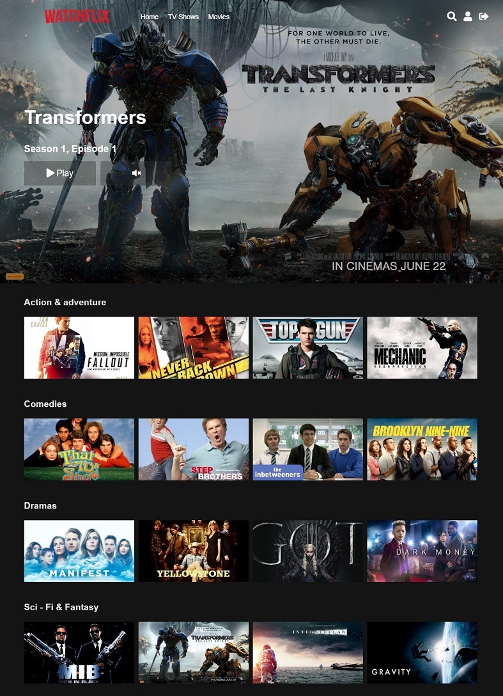
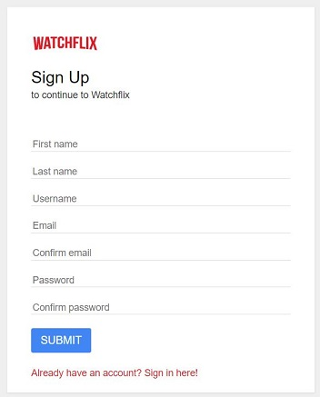

# watchflix
#### Netflix Clone

Created while Learning object oriented programming PHP + MySQL with some Ajax, JavaScript, jQuerry and CSS.

#### Main features:
- Video player
- Search for movies and TV shows
- Resume watching where you left off
- Next episode suggestion

Index page of Watchflix:

List of all episodes of one TV Show. Already seen videos marked with checkbox:

Video search:

User's profile page:

Registration page:

Based on lessons from [Reece Kenney](https://www.udemy.com/user/reecekenney).

Project uses public domain videos and images (copyright free).
